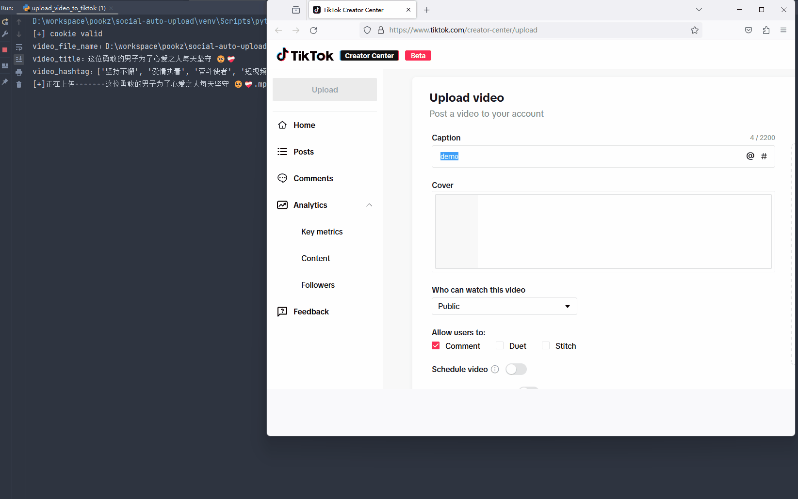

# social-auto-upload
social-auto-upload 该项目旨在自动化发布视频到各个社交媒体平台



## 💡Feature
- 中国主流社交媒体平台：
  - [x] 抖音
  - [x] 视频号
  - [x] bilibili
  - [x] 小红书
  - [x] 快手
  - [ ] 百家号

- 部分国外社交媒体：
  - [x] tiktok
  - [ ] youtube

---
- [ ] 易用版本(支持非开发人员使用)：Gui or Cli
- [ ] API 封装
  - [ ] Docker 部署
- [ ] 自动化上传(schedule)
- [x] 定时上传(cron)
- [ ] cookie 管理
- [ ] 国外平台proxy 设置
- [ ] 多线程上传
- [ ] slack 推送


# 💾Installation
```
pip install -r requirements.txt
playwright install chromium firefox
```
非程序员，[新手级教程](https://juejin.cn/post/7372114027840208911)

# 🐇 About

该项目为我自用项目抽离出来，我的发布策略是定时发布（提前一天发布），故发布部分采用的事件均为第二天的时间

如果你有需求立即发布，可自行研究源码或者向我提问

# 📃详细文档
请查看[详细文档](https://sap-doc.nasdaddy.com/)

## 🐾Communicate
[Donate as u like](https://www.buymeacoffee.com/hysn2001m)

如果你也是`一个人`，喜欢`折腾`， 想要在如此恶劣的大环境寻找突破

希望探索 #技术变现 #AI创业 #跨境航海 #自动化上传 #自动化视频 #技术探讨 

可以来群里和大家交流

|||
|:-:|:-:|
|后台回复 `上传` 加群交流|如果你觉得有用|


## Star History
> 如果这个项目对你有帮助，⭐以表示支持 

[](https://star-history.com/#dreammis/social-auto-upload&Date)
