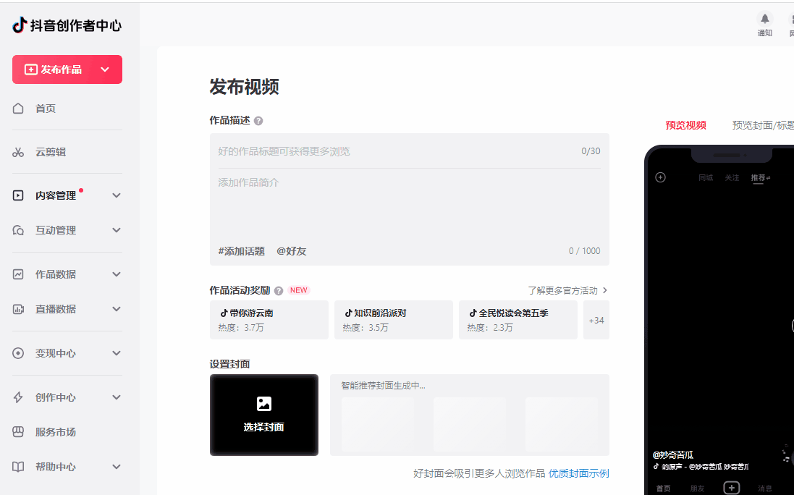
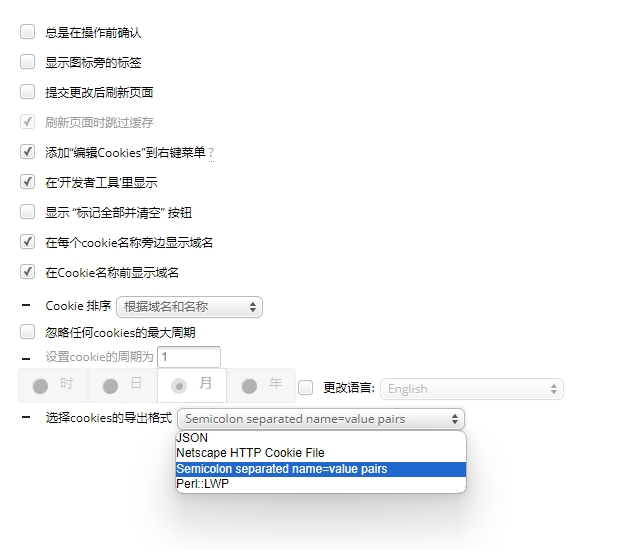
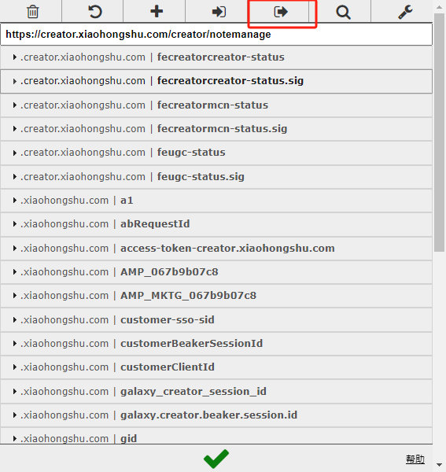

# social-auto-upload
social-auto-upload 该项目旨在自动化发布视频到各个社交媒体平台


## 💡Feature
- 中国主流社交媒体平台：
  - 抖音
  - 视频号
  - bilibili
  - 小红书

- 部分国外社交媒体：
  - tiktok
  - youtube
- 自动化上传(schedule)
- 定时上传(cron)
- cookie 管理
- 国外平台proxy 设置
- 多线程上传
- slack 推送


# 💾Installation
```
pip install -r requirements.txt -i https://pypi.tuna.tsinghua.edu.cn/simple
playwright install chromium
```

# 🐇 About
该项目为我自用项目抽离出来，我的发布策略是定时发布（提前一天发布），故发布部分采用的事件均为第二天的时间

如果你有需求立即发布，可自行研究源码或者向我提问


# 核心模块解释

## 1. 视频文件准备
filepath 本地视频目录，目录包含
- 视频文件
- 视频meta信息txt文件

举例：
file：2023-08-24_16-29-52 - 这位勇敢的男子为了心爱之人每天坚守 .mp4

meta_file:2023-08-24_16-29-52 - 这位勇敢的男子为了心爱之人每天坚守 .txt

meta_file 内容：
```angular2html
这位勇敢的男子为了心爱之人每天坚守 🥺❤️‍🩹
#坚持不懈 #爱情执着 #奋斗使者 #短视频
```

### 2. 抖音


使用playwright模拟浏览器行为
> 抖音前端实现，诸多css class id 均为随机数，故项目中locator多采用相对定位，而非固定定位
1. 准备视频目录结构
2. cookie获取：get_douyin_cookie.py 扫码登录
3. 上传视频：upload_video_to_douyin.py


其他部分解释：
```
douyin_setup handle 参数为True，为手动获取cookie False 则是校验cookie有效性

generate_schedule_time_next_day 默认从第二天开始（此举为避免选择时间的意外错误）
参数解释：
- total_videos 本次上传视频个数
- videos_per_day 每日上传视频数量
- daily_times 视频发布时间 默认6、11、14、16、22点
- start_days 从第N天开始
```


参考项目：
- https://github.com/wanghaisheng/tiktoka-studio-uploader
- https://github.com/Superheroff/douyin_uplod
- https://github.com/lishang520/DouYin-Auto-Upload.git


### 3. 小红书
该实现，借助ReaJason的[xhs](https://github.com/ReaJason/xhs)，再次感谢。

1. 目录结构同上
2. cookie获取，可使用chrome插件：EditThisCookie
- 设置导出格式

- 导出

3. 黏贴至 accounts.ini文件中


#### 解释与注意事项：

##### 上传方式
- 本地签名
- 自建签名服务

测试下来发现本地签名，在实际多账号情况下会存在问题
故如果你有多账号分发，建议采用自建签名服务（todo 上传docker配置）

##### 疑难杂症
遇到签名问题，可尝试更新cdn.jsdelivr.net_gh_requireCool_stealth.min.js_stealth.min.js文件
https://github.com/requireCool/stealth.min.js

参考： https://reajason.github.io/xhs/basic

##### todo
- 扫码登录方式（实验下来发现与浏览器获取的存在区别，会有问题，未来再研究）


参考项目：
- https://github.com/ReaJason/xhs

### 其余部分(todo)
整理后上传

# 联系我
探讨自动化上传、自动制作视频


