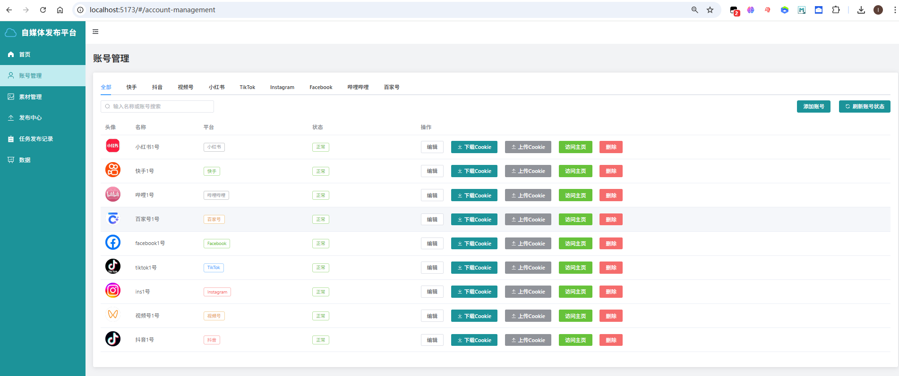
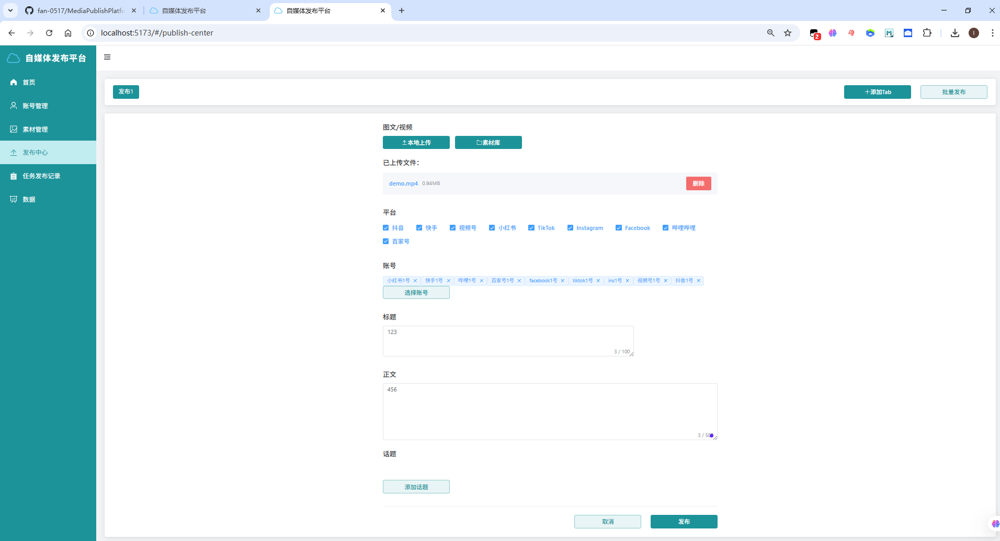
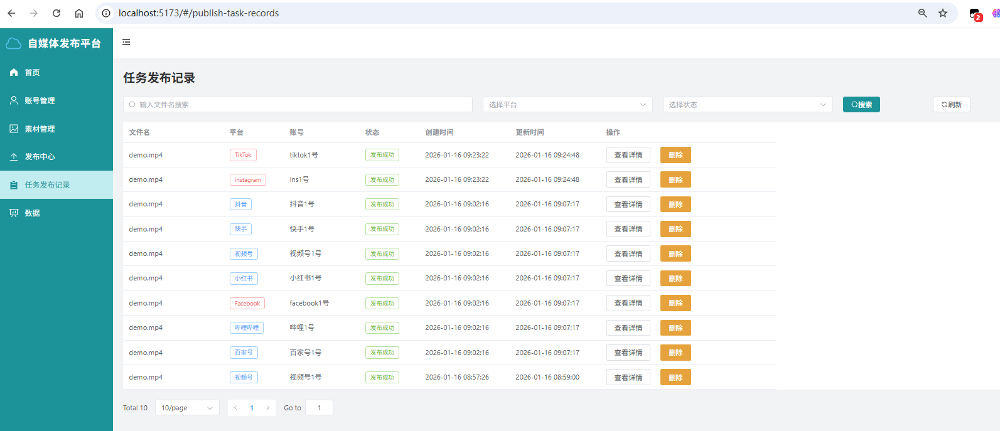

# 自媒体发布平台 (MPP - MediaPublishPlatform)

<div align="center">
  <h3>🚀 多平台自媒体发布平台</h3>
  <p>支持图文和视频内容的批量上传与定时发布，实现多平台自动化运营</p>
  
  <p>
    <a href="https://github.com/funfan0517/MediaPublishPlatform.git" target="_blank">
      
    </a>
    <a href="https://github.com/funfan0517/MediaPublishPlatform.git" target="_blank">
      
    </a>
    
    
    
  </p>
</div>

## 项目地址

[GitHub 仓库](https://github.com/funfan0517/MediaPublishPlatform.git)

## 项目介绍

MPP (MediaPublishPlatform) 是一个功能强大的自媒体发布平台，支持多个平台的图文和视频内容的批量上传与定时发布，帮助内容创作者实现多平台自动化运营。

> **项目起源**：本项目是基于 [dreammis/social-auto-upload](https://github.com/dreammis/social-auto-upload) 进行二次开发的项目，在原项目基础上进行了以下增强：
> - 新增平台支持：扩展了 TikTok、Instagram、Facebook、B站、百家号等平台
> - 统一了各平台的登录和验证流程：简化了多平台账号管理，提高了系统的稳定性和可维护性
> - 统一各平台的发布流程：实现了新版通用基类架构的文件上传系统
> - 实现一键发布功能：支持一键发布多个媒体文件到多个平台
> - 增加发布记录管理功能：支持查看完整的发布记录，包括发布状态、时间和结果
> - 提高扩展性：新增平台时支持只需修改 `platform_configs.py` 配置文件即可
> - 完善了前端界面，优化了用户体验
> - 优化了代码结构和文档


### 主要特点

- **多平台支持**：覆盖主流自媒体平台，包括小红书、腾讯视频号、抖音、快手、TikTok、Instagram、Facebook、B站、百家号等
- **一键发布**：支持一键发布多个媒体文件到多个平台，提高发布效率
- **自动化发布**：基于 Playwright 的浏览器自动化技术，实现无人值守发布
- **批量操作**：支持多文件批量上传和多账号轮换发布
- **定时发布**：灵活的定时发布功能，支持自定义发布时间和发布频率
- **发布记录**：支持查看完整的发布记录，包括发布状态、时间和结果
- **统一管理**：提供统一的Web界面，集中管理所有发布任务
- **统一登录与验证**：简化多平台账号管理，提高系统的稳定性和可维护性
- **易于扩展**：模块化设计，新增平台支持只需修改 `platform_configs.py` 配置文件即可

## 核心功能

### 1. 多平台支持

| 平台 | 新版支持 | 旧版支持 |
|------|----------|----------|
| 小红书 | ✅ | ✅ |
| 腾讯视频号 | ✅ | ✅ |
| 抖音 | ✅ | ✅ |
| 快手 | ✅ | ✅ |
| TikTok | ✅ | ✅ |
| Instagram | ✅ | ❌ |
| Facebook | ✅ | ❌ |
| B站 | ✅ | ✅ |
| 百家号 | ✅ | ✅ |

### 2. 平台示例展示

#### 小红书


#### 腾讯视频号


#### 抖音


#### 快手


#### TikTok


#### Instagram


#### Facebook


#### B站


#### 百家号


### 3. 内容类型支持

- ✅ 视频文件上传
- ✅ 图文内容发布
- ✅ 封面设置（部分平台）

### 4. 发布功能

- ✅ 即时发布
- ✅ 定时发布，支持自定义发布时间
- ✅ 批量发布，支持多账号轮换
- ✅ 发布计划管理

### 5. 管理功能

- ✅ 文件上传和管理
- ✅ 发布历史记录
- ✅ 账号管理（添加、编辑、删除）
- ✅ Cookie 管理（上传、下载）
- ✅ 平台统计数据
- ✅ 任务状态监控

### 6. 系统功能

- ✅ 跨域支持
- ✅ 错误处理
- ✅ 日志记录
- ✅ 状态反馈
- ✅ 双版本上传系统

## 安装指南

### 环境要求

- **后端**：Python 3.10+, Chrome 浏览器
- **前端**：Node.js 18+, npm 9+

### 快速开始
#### 首次启动项目

1. **克隆项目**

```bash
git clone https://github.com/funfan0517/MediaPublishPlatform.git
cd SAU
```

2. **安装 Python 依赖**

```bash
# 创建虚拟环境（推荐）
python -m venv venv

# 激活虚拟环境
# Windows
venv\Scripts\activate
# Linux/MacOS
source venv/bin/activate

# 安装依赖
pip install -r requirements.txt -i https://pypi.tuna.tsinghua.edu.cn/simple
```

3. **安装 Playwright 浏览器驱动**

```bash
playwright install chromium
```

4. **初始化数据库**

```bash
# 运行数据库初始化脚本
python db/createTable.py
```

5. **配置 Chrome 浏览器路径**

修改 `sau_backend/conf.py` 文件底部的 `LOCAL_CHROME_PATH` 为本地 Chrome 浏览器地址：

```python
# Windows 示例
LOCAL_CHROME_PATH = "C:\Program Files\Google\Chrome\Application\chrome.exe"

# Linux 示例  
LOCAL_CHROME_PATH = "/usr/bin/google-chrome"

# macOS 示例
LOCAL_CHROME_PATH = "/Applications/Google Chrome.app/Contents/MacOS/Google Chrome"
```

6. **启动后端服务**

```bash
cd sau_backend
python sau_backend.py
```

后端服务将在 `http://localhost:5409` 启动。

7. **安装前端依赖并启动**

```bash
cd ../sau_frontend
npm install
npm run dev
```

前端项目将在 `http://localhost:5173` 启动，在浏览器中打开此链接即可访问。

#### Windows 快速启动（非首次启动）

对于 Windows 用户，您可以使用项目根目录下的 `start-win.bat` 脚本快速启动前后端服务：

```bash
start-win.bat
```

此脚本将自动激活虚拟环境（如果存在）并启动后端服务。

## 项目架构

### 后端架构

后端采用模块化设计，基于 Flask 框架构建 RESTful API 服务，结合 Playwright 实现浏览器自动化上传，核心组件包括：

1. **核心上传引擎** (`sau_backend/newFileUpload/baseFileUploader.py`)
   - 通用多平台上传器基类，定义了统一的上传接口和流程
   - 支持多平台配置（小红书、腾讯、抖音、快手、TikTok、Instagram 等）
   - 使用 Playwright 实现浏览器自动化操作
   - 支持图文和视频两种内容类型
   - 提供定时发布、标签管理等核心功能

2. **多文件上传处理** (`sau_backend/newFileUpload/multiFileUploader.py`)
   - 批量文件处理，支持多账号轮换
   - 自动生成发布计划时间
   - 异步执行上传任务
   - 提供完整的发布结果反馈

3. **Flask 后端服务** (`sau_backend/sau_backend.py`)
   - RESTful API 接口设计
   - 文件上传、保存和查询功能
   - 支持跨域请求
   - 数据库集成，记录文件上传历史
   - 提供用户认证和权限管理

4. **平台配置管理** (`sau_backend/newFileUpload/platform_configs.py`)
   - 集中管理各平台配置（类型、URL、选择器等）
   - 提供平台类型与标识的映射函数
   - 便于添加新平台支持

6. **统一登录与验证系统**
   - **统一登录逻辑** (`sau_backend/myUtils/login.py`)
     - 支持多平台统一登录，自动生成并保存 Cookie
     - 基于 Playwright 的浏览器自动化登录
     - 实时返回登录状态，支持可视化登录流程
     - 自动将账号信息保存到数据库
     - 支持账号删除功能，自动清理关联的 Cookie 文件
   - **统一验证逻辑** (`sau_backend/myUtils/auth.py`)
     - 通用 Cookie 有效性验证方法
     - 基于平台配置的智能验证策略
     - 支持多平台账号状态检测
     - 自动识别登录状态，确保发布任务的可靠性
     - 详细的日志记录，便于问题排查

### 前端架构

前端基于 Vue 3 + Element Plus 构建，提供直观易用的用户界面：

- **响应式设计**：适配不同屏幕尺寸
- **现代化界面**：使用 Element Plus 组件库，提供美观的用户体验
- **实时状态反馈**：发布任务状态实时更新
- **文件管理**：可视化的文件上传和管理界面
- **账号管理**：集中管理所有平台账号
- **发布中心**：创建和管理发布任务
- **任务记录**：查看和管理发布任务记录

## 技术栈

### 后端技术

| 技术 | 版本 | 用途 |
|------|------|------|
| Flask | 2.0+ | Web 框架 |
| Playwright | 1.30+ | 浏览器自动化 |
| SQLite | 3 | 数据库 |
| asyncio | - | 异步处理 |
| pathlib | - | 文件管理 |

### 前端技术

| 技术 | 版本 | 用途 |
|------|------|------|
| Vue 3 | - | 前端框架 |
| Vite | 6.4+ | 构建工具 |
| Element Plus | - | UI 组件库 |
| Vue Router | 4 | 路由管理 |
| Pinia | - | 状态管理 |
| Axios | - | HTTP 请求库 |
| Sass | - | CSS 预处理器 |

## 项目结构

```
sau/
├── README.md              # 项目说明文档
├── start-win.bat          # Windows 启动脚本
├── requirements.txt       # Python 依赖包
├── sau_backend/           # 后端项目
│   ├── README.md          # 后端说明文档
│   ├── conf.py            # 配置文件
│   ├── sau_backend.py     # 后端主入口文件
│   ├── myUtils/           # 核心工具模块
│   │   ├── auth.py        # 认证相关功能
│   │   └── login.py       # 登录相关功能
│   ├── newFileUpload/     # 新版文件上传实现（推荐）
│   │   ├── baseFileUploader.py    # 通用上传器基类
│   │   ├── multiFileUploader.py   # 多文件上传处理
│   │   └── platform_configs.py    # 平台配置
│   ├── oldFileUpload/     # 旧版文件上传实现（备用）
│   │   ├── examples/      # 示例脚本
│   │   └── uploader/      # 各平台上传器实现
│   └── utils/             # 工具函数
│       ├── base_social_media.py   # 社交媒体基础功能
│       ├── log.py                 # 日志管理
│       └── stealth.min.js         # 浏览器隐藏脚本
├── sau_frontend/          # 前端项目
│   ├── README.md          # 前端说明文档
│   ├── src/               # 前端源代码
│   │   ├── api/           # API 接口
│   │   ├── components/    # 公共组件
│   │   ├── router/        # 路由配置
│   │   ├── stores/        # 状态管理
│   │   ├── styles/        # 样式文件
│   │   ├── utils/         # 工具函数
│   │   ├── views/         # 页面组件
│   │   ├── App.vue        # 根组件
│   │   └── main.js        # 入口文件
│   ├── public/            # 静态资源
│   ├── package.json       # npm 配置
│   └── vite.config.js     # Vite 配置
├── db/                    # 数据库相关
│   ├── database.db        # SQLite 数据库文件
│   └── createTable.py     # 数据库初始化脚本
├── cookiesFile/           # 存储 Cookie 文件
├── videoFile/             # 存储上传的视频文件
└── videos/                # 示例视频文件
```

## API 文档

### 账号管理

| 接口 | 方法 | 描述 | 参数 | 返回 |
|------|------|------|------|------|
| `/getAccounts` | GET | 获取所有账号信息 | 无 | 账号列表 |
| `/getValidAccounts` | GET | 获取有效的账号信息 | 无 | 有效账号列表 |
| `/account` | POST | 添加账号 | JSON 数据 | 操作结果 |
| `/updateUserinfo` | POST | 更新账号信息 | JSON 数据 | 操作结果 |
| `/deleteAccount` | GET | 删除账号 | `id`：账号 ID | 操作结果 |
| `/downloadCookie` | GET | 下载 Cookie 文件 | `filePath`：文件路径 | Cookie 文件 |
| `/uploadCookie` | POST | 上传 Cookie 文件 | 文件数据 | 操作结果 |

### 文件管理

| 接口 | 方法 | 描述 | 参数 | 返回 |
|------|------|------|------|------|
| `/upload` | POST | 上传文件 | 文件数据 | 文件唯一 ID |
| `/getFiles` | GET | 获取文件列表 | 无 | 文件列表 |

### 发布管理

| 接口 | 方法 | 描述 | 参数 | 返回 |
|------|------|------|------|------|
| `/postVideo` | POST | 发布视频到单个平台 | JSON 数据 | 操作结果 |
| `/postVideosToMultiplePlatforms` | POST | **一键发布**：发布多个视频到多个平台 | JSON 数据 | 操作结果 |
| `/getPublishTaskRecords` | GET | **发布记录**：获取发布任务记录 | `page`：页码<br>`page_size`：每页记录数 | 任务记录列表 |
| `/getPlatformStats` | GET | 获取平台统计数据 | 无 | 平台统计信息 |
| `/cancelTask` | GET | 取消发布任务 | `id`：任务 ID | 操作结果 |
| `/taskStatus` | GET | 获取发布任务状态 | `id`：任务 ID | 任务状态 |
| `/platformConfig` | GET | 获取平台特定参数配置 | `type`：平台标识 | 平台配置 |

### 登录接口

| 接口 | 方法 | 描述 | 参数 | 返回 |
|------|------|------|------|------|
| `/login` | GET | 登录接口（SSE 连接） | `id`：用户名<br>`type`：平台标识 | 登录二维码 |

## 平台标识对照表

| 平台 | type字段值 | 平台标识 | 新版支持 | 旧版支持 |
|------|-----------|---------|---------|---------|
| 小红书 | 1 | xiaohongshu | ✅ | ✅ |
| 腾讯视频号 | 2 | tencent | ✅ | ✅ |
| 抖音 | 3 | douyin | ✅ | ✅ |
| 快手 | 4 | kuaishou | ✅ | ✅ |
| TikTok | 5 | tiktok | ✅ | ✅ |
| Instagram | 6 | instagram | ✅ | ❌ |
| Facebook | 7 | facebook | ✅ | ❌ |
| B站 | 8 | bilibili | ✅ | ✅ |
| 百家号 | 9 | baijiahao | ✅ | ✅ |

## 快速开始使用

### 1. 登录系统

打开浏览器，访问 `http://localhost:5173`，进入系统登录页面。

### 2. 添加账号

1. 点击左侧导航栏的「账号管理」
2. 点击「添加账号」按钮
3. 选择平台类型
4. 按照提示完成登录操作
5. 系统会自动保存 Cookie 并创建账号



### 3. 上传文件

1. 点击左侧导航栏的「素材管理」
2. 点击「上传文件」按钮
3. 选择要上传的视频或图片文件
4. 等待上传完成

### 4. 发布内容

1. 点击左侧导航栏的「发布中心」
2. 选择要发布的文件
3. 选择发布平台和账号
4. 填写标题、正文和标签
5. 设置发布时间（可选）
6. 点击「发布」按钮，系统将自动执行发布任务



### 5. 查看发布记录

1. 点击左侧导航栏的「任务发布记录」
2. 查看所有发布任务的状态和详情
3. 对失败的任务进行重试，对进行中的任务进行取消



## 部署方案

### 本地开发环境

按照「安装指南」中的步骤部署到本地机器。

### Docker 部署

1. 构建 Docker 镜像：

```bash
docker build -t sau .
```

2. 运行 Docker 容器：

```bash
docker run -d -p 5409:5409 -p 5173:5173 --name mpp mpp
```

3. 访问应用：

打开浏览器，访问 `http://localhost:5173`

### 生产环境部署

1. 构建前端项目：

```bash
cd sau_frontend
npm run build
```

2. 配置后端服务：

- 修改 `sau_backend/conf.py` 中的配置
- 配置反向代理（如 Nginx）
- 设置环境变量

3. 启动服务：

使用 Supervisor 或 Systemd 管理服务进程。

4. Nginx 配置示例：

```nginx
server {
    listen 80;
    server_name your-domain.com;
    
    location / {
        root /path/to/sau_frontend/dist;
        index index.html;
        try_files $uri $uri/ /index.html;
    }
    
    location /api {
        proxy_pass http://localhost:5409;
        proxy_set_header Host $host;
        proxy_set_header X-Real-IP $remote_addr;
        proxy_set_header X-Forwarded-For $proxy_add_x_forwarded_for;
    }
}
```

## 技术实现细节

### 浏览器自动化

系统使用 Playwright 库实现浏览器自动化，主要流程包括：

1. 启动浏览器实例
2. 加载平台登录页面
3. 使用存储的 Cookie 进行登录
4. 导航到发布页面
5. 自动填充发布信息（标题、正文、标签等）
6. 上传媒体文件
7. 执行发布操作
8. 验证发布结果

### 统一登录与验证实现

#### 统一登录流程

1. 接收前端传递的平台类型和账号名
2. 根据平台类型获取对应的平台配置
3. 生成唯一的 Cookie 文件名
4. 启动 Playwright 浏览器，配置自动化参数
5. 导航到平台登录页面
6. 实时返回登录状态，等待用户完成登录操作
7. 定期检查登录状态（URL变化或Cookie包含认证信息）
8. 登录成功后，保存 Cookie 到本地文件
9. 将账号信息插入数据库，标记为有效状态

#### 统一验证流程

1. 接收平台类型和 Cookie 文件路径
2. 根据平台类型获取对应的平台配置
3. 获取平台个人中心 URL
4. 使用 Playwright 启动无头浏览器，加载 Cookie
5. 访问平台个人中心页面
6. 检查 URL 是否包含登录相关关键词
7. 检查页面内容是否包含登录提示
8. 验证成功后，返回有效状态；否则返回无效状态
9. 记录详细的验证日志，便于问题排查

### 定时发布实现

定时发布功能通过以下方式实现：

1. 计算发布时间点
2. 创建发布任务队列
3. 使用线程池执行定时任务
4. 任务执行时唤醒浏览器并执行发布操作

### 多账号轮换

系统支持多账号轮换发布，实现方式：

1. 为每个平台维护账号池
2. 发布时按顺序或随机选择账号
3. 记录每个账号的使用情况
4. 避免单个账号发布频率过高

## 常见问题

### 1. Cookie 过期怎么办？

当 Cookie 过期时，系统会自动检测到并标记账号状态为「失效」。您需要重新登录该账号以更新 Cookie：

1. 在账号管理页面，找到状态为「失效」的账号
2. 点击「重新登录」按钮
3. 按照提示完成登录操作
4. 系统会自动更新 Cookie 并恢复账号状态

### 2. 发布失败怎么办？

发布失败可能有多种原因，您可以：

1. 查看发布历史中的错误信息
2. 检查账号状态是否正常
3. 检查网络连接是否稳定
4. 确认平台是否有发布限制
5. 尝试重新发布

### 3. 如何添加新平台支持？

MPP 系统采用模块化设计，新增平台支持非常简单，只需修改 `sau_backend/newFileUpload/platform_configs.py` 文件即可：

1. 在 `PLATFORM_CONFIGS` 字典中添加新平台的配置信息
2. 配置项包括：平台类型编号、名称、URL、选择器和功能支持
3. 无需修改登录逻辑和 Cookie 验证逻辑
4. 系统会自动识别新平台并支持发布功能

**配置示例**：
```python
"new_platform": {
    "type": 10,
    "platform_name": "new_platform",
    "personal_url": "https://example.com/",
    "login_url": "https://example.com/login",
    "creator_video_url": "https://example.com/upload/video",
    "creator_image_url": "https://example.com/upload/image",
    "selectors": {
        "upload_button": ['button:has-text("上传")'],
        "publish_button": ['button:has-text("发布")'],
        "title_editor": ['input[placeholder="标题"]'],
        "textbox_selectors": ['div[contenteditable="true"]'],
        "thumbnail_button": ['button:has-text("封面")'],
        "thumbnail_finish": ['button:has-text("完成")'],
        "schedule_button": ['button:has-text("定时")'],
        "date_input": ['input[type="date"]'],
        "time_input": ['input[type="time"]'],
    },
    "features": {
        "skip_cookie_verify": True,
        "image_publish": True,
        "title": True,
        "textbox": True,
        "tags": True,
        "thumbnail": True,
        "location": False,
        "schedule": True
    }
}
```

### 4. 系统运行缓慢怎么办？

系统运行缓慢可能是由于：

1. 浏览器实例启动过多
2. 发布任务队列过长
3. 系统资源不足

解决方案：
- 减少同时执行的发布任务数量
- 增加系统内存和 CPU 资源
- 优化网络连接

## 贡献指南

我们欢迎社区贡献，包括但不限于：

1. **代码贡献**：提交 Pull Request 来修复 bug 或添加新功能
2. **平台支持**：添加对新平台的支持
3. **文档完善**：改进文档，添加使用示例
4. **问题反馈**：报告 bug 或提出新功能建议

### 贡献流程

1. Fork 本仓库
2. 创建您的特性分支 (`git checkout -b feature/AmazingFeature`)
3. 提交您的更改 (`git commit -m 'Add some AmazingFeature'`)
4. 推送到分支 (`git push origin feature/AmazingFeature`)
5. 打开 Pull Request

### 代码规范

- 遵循 PEP 8 代码规范（Python）
- 遵循 ESLint 代码规范（JavaScript/TypeScript）
- 为新功能添加测试用例
- 确保代码通过所有测试

## 许可证

本项目基于 MIT 协议开源，详见 [LICENSE](LICENSE) 文件

## 交流与支持
**GitHub Issues**：[https://github.com/funfan0517/MediaPublishPlatform/issues](https://github.com/funfan0517/MediaPublishPlatform/issues)

<details>
<summary>💖 支持这个项目（点击展开）</summary>
这个项目是我利用业余时间开发和维护的，旨在帮助更多开发者解决多账号多平台视频发布问题。如果它帮到了你，欢迎通过以下方式支持我。
<p align="center">
  
  
</p>
你的支持资金将用于**服务器运维、功能优化和文档完善**，我会定期在仓库同步进展，也会邀请你参与功能投票，一起把工具做得更实用，让项目走得更远～
</details>


## Star History
**感谢使用 MPP 自媒体发布平台！** 🚀
如果这个项目对您有帮助，请给一个 ⭐ Star 以表示支持！

[](https://www.star-history.com/#funfan0517/MediaPublishPlatform&type=date&legend=top-left)