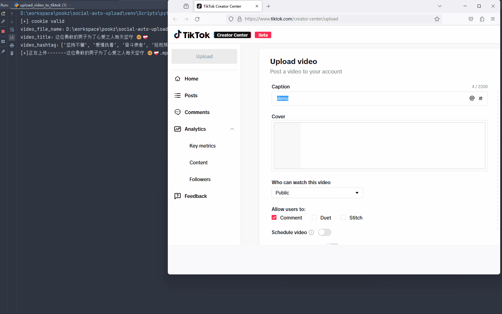

# social-auto-upload

`social-auto-upload` 是一个强大的自动化工具，旨在帮助内容创作者和运营者高效地将视频内容一键发布到多个国内外主流社交媒体平台。
项目实现了对 `抖音`、`Bilibili`、`小红书`、`快手`、`视频号`、`百家号` 以及 `TikTok` 等平台的视频上传、定时发布等功能。
结合各平台 `uploader` 模块，您可以轻松配置和扩展支持的平台，并通过示例脚本快速上手。



## 目录

- [💡 功能特性](#💡功能特性)
- [💾 安装指南](#💾安装指南)
- [🤖 AI Agent](#🤖ai-agent)
- [🏁 快速开始](#🏁快速开始)
- [🗂️ 重构计划](#🗂️重构计划)
- [📣 近况说明](#📣近况说明)
- [🐇 项目背景](#🐇项目背景)
- [📃 详细文档](#📃详细文档)
- [🐾 交流与支持](#🐾交流与支持)
- [🤝 贡献指南](#🤝贡献指南)
- [📜 许可证](#📜许可证)
- [⭐ Star History](#⭐Star-History)

## 💡功能特性

| 平台 | 登录/账号准备 | 视频上传 | 图文上传 | 定时发布 | CLI | Skill | 说明 |
| --- | --- | --- | --- | --- | --- | --- | --- |
| 抖音 | ✅ | ✅ | ✅ | ✅ | ✅ | ✅ | 当前主线重构最完整 |
| Bilibili | ✅ | ✅ | ❌ | ✅ | ✅ | ✅ | 运行时自动准备 `biliup` |
| 小红书（浏览器版） | ✅ | ✅ | ✅ | ✅ | ✅ | ✅ | 浏览器自动化，CLI/Skill 已接入 |
| 快手 | ✅ | ✅ | ✅ | ✅ | ✅ | ✅ | 浏览器自动化，CLI/Skill 初版已接入 |
| 视频号 | ✅ | ✅ | ❌ | ✅ | ❌ | ❌ | 对应 `tencent_uploader` |
| 百家号 | ✅ | ✅ | ❌ | ✅ | ❌ | ❌ | 浏览器自动化 |
| TikTok | ✅ | ✅ | ❌ | ✅ | ❌ | ❌ | 当前示例走 Chrome 版实现 |

### AI这么强，为什么还需要这个项目
在你使用AI的能力，browser agent等等，每次都让 agent 重新解析网页、截图理解, 临场判断
该项目经过大量验证，上传这种 高频，重复，无聊的工作交给脚本和程序去执行


## 💾安装指南

### 自己上手使用
如果你只是普通用户，不准备借助 agent 客户端，直接看

安装、更新、环境准备已经统一收敛到文档：

- [安装说明](./docs/install.md)
- [更新说明](./docs/update.md)


### AGENT 

```
AI的发展毋庸置疑，希望你遇到这种安装和使用，不要再怯场，而是交给各种AI Agent来协助你
```

如果你准备把这个仓库直接交给 `OpenClaw`、`Codex`、`Claude Code` 来安装和使用

先把仓库给 agent，再把这份启动提示词一起发给它：

- [Agent Bootstrap Prompt](./docs/agent-bootstrap.md)

这份提示词会引导 agent：

- 优先按当前主线安装项目
- 优先使用 `uv`、`sau` CLI 和 `skills/`
- 先验证 `bilibili`、`douyin`、`kuaishou`、`xiaohongshu` 四个平台入口是否可用


### 补充说明：

- CLI 使用请看：[CLI 使用说明](./docs/CLI.md)
- 如果你准备在 `OpenClaw`、`Codex`、`Claude Code / cc` 里使用本项目，先看：[Agent Bootstrap Prompt](./docs/agent-bootstrap.md)
- agent / skill 请看：[Douyin Upload Skill](./skills/douyin-upload/SKILL.md)
- agent / skill 请看：[Kuaishou Upload Skill](./skills/kuaishou-upload/SKILL.md)
- agent / skill 请看：[Xiaohongshu Upload Skill](./skills/xiaohongshu-upload/SKILL.md)
- agent / skill 请看：[Bilibili Upload Skill](./skills/bilibili-upload/SKILL.md)
- 历史 Web 说明请看：[历史 Web 版本说明](./docs/legacy-web.md)
- 其他单平台 skill 与整合型 skill 仍在开发中
- `requirements.txt` 目前主要用于历史兼容路径，普通用户不需要优先使用它


## 📣近况说明

`2026.03.24`

最近我的重心一直都在创业上，而且手里还有一些项目没完全跑通，所以这个仓库前面有很长一段时间，我确实没有办法投入特别多精力去持续维护。

这个项目不知不觉已经 `9k+ star` 了，社群里也已经有 `2000+` 小伙伴了。看到它真的在持续帮到大家，我心里还是挺开心的，也是真的很感谢大家一直以来的支持、反馈。

所以我想，决定先停一下，抽一段时间出来，把这个项目好好重构和优化一轮。

接下来这段时间，这个仓库应该会进入一个相对密集更新的阶段。我现在最想先做的事情主要有这几件：

1. 使用更隐蔽、更稳定的自动化方案，尽量降低平台检测风险
2. 补齐一些常用平台的图文能力，并逐步完成 CLI 化、Skill 化
3. 陆续测试并上架到更多 skill 平台，让大家的龙虾、螃蟹、毛毛虫都能打通 AI 自媒体的最后一道关

所以如果你之前觉得这个项目更新有点慢，哈哈哈，后面大概率会快很多。也欢迎大家继续关注，最近应该会是一段持续修、持续更、持续重构的阶段。

## 🗂️重构计划

项目正在进行一轮整体重构，当前重构重点是：

- 各平台 uploader 的结构收敛
- CLI 统一接入
- 面向 OpenClaw、Codex、 Claude Code 等工具的 skill 化
- 更换为 `patchright` 驱动，提升兼容性与隐蔽性
- 主线优先围绕无头模式推进

“无头模式（headless）”，指的是浏览器在后台运行，不弹出可见窗口，但自动化流程仍然会照常执行。这样更适合 CLI、服务端、自动任务和 agent 场景。

Web 端相关代码仍然保留，但已经不是当前主线，不保证可直接运行，也不保证与当前 uploader/CLI 完全同步。


## 🏁快速开始

### 方式 1：使用 CLI

当前抖音、快手、小红书、Bilibili 已经接入 CLI：

```bash
sau douyin login --account <account_name>
sau douyin check --account <account_name>
sau douyin upload-video --account <account_name> --file videos/demo.mp4 --title "示例标题" --desc "示例简介"
sau douyin upload-note --account <account_name> --images videos/1.png videos/2.png --title "图文标题" --note "图文正文"

sau kuaishou login --account <account_name>
sau kuaishou check --account <account_name>
sau kuaishou upload-video --account <account_name> --file videos/demo.mp4 --title "示例标题" --desc "示例简介"
sau kuaishou upload-note --account <account_name> --images videos/1.png videos/2.png videos/3.png --title "图文标题" --note "图文正文"

sau xiaohongshu login --account <account_name>
sau xiaohongshu check --account <account_name>
sau xiaohongshu upload-video --account <account_name> --file videos/demo.mp4 --title "示例标题" --desc "示例简介"
sau xiaohongshu upload-note --account <account_name> --images videos/1.png videos/2.png videos/3.png --title "图文标题" --note "图文正文"

sau bilibili login --account <account_name>
sau bilibili check --account <account_name>
sau bilibili upload-video --account <account_name> --file videos/demo.mp4 --title "示例标题" --desc "示例简介" --tid 249
```

补充说明：

- `creator` 之类的名字只是示例值，真正含义是 `account_name`
- 一个 `account_name` 对应一个账号文件，可以准备多个账号，也可以按账号名并发执行任务
- 浏览器平台统一约定：
- 视频使用 `title + desc + tags`
- 图文使用 `title + note + tags`
- Bilibili CLI 不要求用户手动安装 `biliup`
- 首次运行相关命令时，程序会自动下载 `biliup`
- 后续运行会自动检查上游 release 并更新
- Bilibili 登录建议由用户自己在本地真实终端里执行；如果终端二维码显示不完整，可以直接打开当前目录下的 `qrcode.png` 扫码

### 方式 2：使用 examples

`examples/` 目录里同时存在两类脚本：

- 当前主线 CLI 包装示例
- 历史直连 uploader 示例

对抖音、快手、小红书、Bilibili 来说，当前主线优先使用上面的 `sau ...` CLI。
下面这些脚本主要是历史直连 uploader 示例或调试入口：

- `examples/upload_to_douyin.py`
- `examples/upload_video_to_bilibili.py`
- `examples/upload_to_kuaishou.py`
- `examples/upload_video_to_tencent.py`
- `examples/upload_video_to_baijiahao.py`
- `examples/upload_video_to_tiktok.py`
- `examples/upload_video_to_xiaohongshu.py`

## 🐇项目背景

该项目最初是我个人用于自动化管理社交媒体视频发布的工具。我的主要发布策略是提前一天设置定时发布，因此项目中很多定时发布相关的逻辑是基于“第二天”的时间进行计算的。

如果您需要立即发布或其他定制化的发布策略，欢迎研究源码或在社区提问。

## 📃详细文档

已落后，目前在快速重构该项目，当下，你需要做的是把这个仓库，发给你的AI agent：qwen code，codex cc，openclaw等等，让他们帮你安装和使用

更详细的文档和说明，请查看：[social-auto-upload 官方文档](https://sap-doc.nasdaddy.com/)

## 🐾交流与支持

[☕ Donate as u like](https://www.buymeacoffee.com/hysn2001m) - 如果您觉得这个项目对您有帮助，可以考虑赞助。

如果您也是独立开发者、技术爱好者，对 #技术变现 #AI创业 #跨境电商 #自动化工具 #视频创作 等话题感兴趣，欢迎加入社群交流。

### Creator

<table>
    <td align="center">
        <a href="https://sap-doc.nasdaddy.com/">
            
            <br />
            <sub><b>微信公众号</b></sub>
        </a>
        <br />
        <a href="https://github.com/dreammis/social-auto-upload/commits?author=dreammis" title="Code">💻</a>
        <br />
        关注公众号，后台回复 `上传` 获取加群方式
    </td>
    <td align="center">
        <a href="https://sap-doc.nasdaddy.com/">
            
            <br />
            <sub><b>交流群 (通过公众号获取)</b></sub>
        </a>
        <br />
        <a href="https://sap-doc.nasdaddy.com/" title="Documentation">📖</a>
        <br />
        如果您觉得项目有用，可以考虑打赏支持一下
    </td>
</table>

### Active Core Team

<table>
    <td align="center">
        <a href="https://leedebug.github.io/">
            
            <br />
            <sub><b>Edan Lee</b></sub>
        </a>
        <br />
        <a href="https://github.com/dreammis/social-auto-upload/commits?author=LeeDebug" title="Code">💻</a>
        <a href="https://leedebug.github.io/" title="Documentation">📖</a>
        <br />
        封装了 api 接口和 web 前端管理界面
        <br />
        （请注明来意：进群、学习、企业咨询等）
    </td>
</table>

## 🤝贡献指南

欢迎各种形式的贡献，包括但不限于：

-   提交 Bug报告 和 Feature请求。
-   改进代码、文档。
-   分享使用经验和教程。

如果您希望贡献代码，请遵循以下步骤：

1.  Fork 本仓库。
2.  创建一个新的分支 (`git checkout -b feature/YourFeature` 或 `bugfix/YourBugfix`)。
3.  提交您的更改 (`git commit -m 'Add some feature'`)。
4.  Push到您的分支 (`git push origin feature/YourFeature`)。
5.  创建一个 Pull Request。

## 🙏致谢

本项目的 Bilibili 上传能力基于开源项目 `biliup` 的能力进行接入与封装。
感谢 `biliup` 项目及其贡献者提供的基础能力：

- https://github.com/biliup/biliup

## 📜许可证

本项目暂时采用 [MIT License](LICENSE) 开源许可证。

## ⭐Star-History

> 如果这个项目对您有帮助，请给一个 ⭐ Star 以表示支持！

[](https://star-history.com/#dreammis/social-auto-upload&Date)

## Community
LINUX DO - The New Ideal Community
