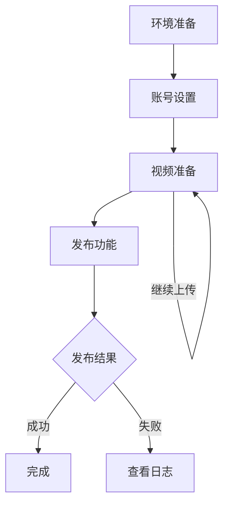

# 抖音视频上传功能使用说明

## 项目概述
本项目提供了一个抖音视频批量上传的功能，用户可以通过该工具将视频上传到抖音平台。

## 主要模块
- **DouYinVideo**: 负责视频上传的核心功能。
- **AccountManager**: 管理抖音账号的登录和cookie信息。
- **UserInfoHelper**: 获取用户信息。
- **DBHelper**: 处理与数据库的交互。
- **VideoValidator**: 验证视频文件、标题、标签等。

## 使用流程
1. **环境准备**: 确保已安装Playwright和相关依赖。
2. **账号设置**: 使用`AccountManager`类设置抖音账号，确保cookie文件有效。
3. **视频准备**: 将待上传的视频放置在指定目录，并确保视频格式符合要求（如.mp4, .mov等）。
4. **调用上传功能**: 使用`DouYinVideo`类的`batch_upload`方法进行批量上传。

## 方法说明
### 1. `batch_upload`
```python
async def batch_upload(self, context: BrowserContext, video_dir: str, account_file: Path, daily_times: List[int] = [16]) -> None:
    """批量上传视频"""
    # 该方法接受浏览器上下文、视频目录和账号文件路径作为参数。
    # 它会验证视频目录，查找视频文件，并进行上传。
```

### 2. `setup_account`
```python
async def setup_account(self, account_file: str, handle: bool = False, context: Optional[BrowserContext] = None) -> Dict[str, Any]:
    """设置抖音账号，优先使用已存在的浏览器会话"""
```

### 3. `get_user_info`
```python
async def get_user_info(page: Page) -> Optional[Dict[str, Any]]:
    """获取用户信息"""
```

## 注意事项
- 确保视频文件和cookie文件的路径正确。
- 处理上传过程中可能出现的错误，查看日志以获取详细信息。

## 流程图
